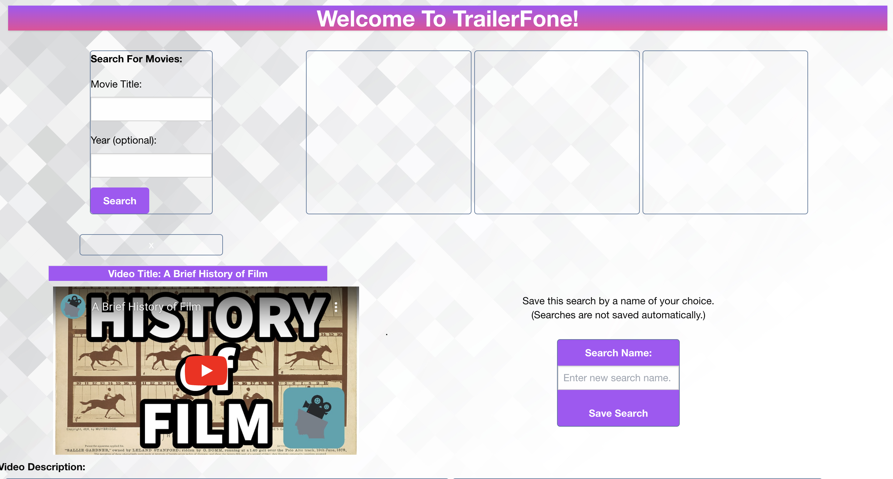
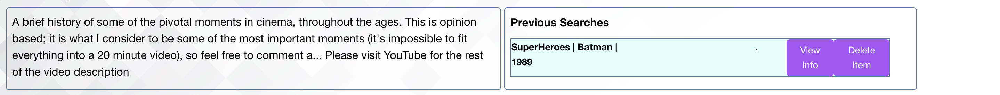

# TrailerPhone OMDb-YouTube

* Please note in December 2024, Tony and Peter split off to continue work on project 1. We asked the other two team members to join our effort, but they were unresponsive. We are resubmitting this updated version of the project as a pair, but leaving them as authors since they did contribute in the initial page launch. *

## README Authors
Peter Martinez  
Amninder Singh  
Sikander Dhaliwal  
Tony Magrady  
    - Berkeley Full-Stack Web Development Bootcamp students  
    -- September 25, 2023  
a.k.a. Team "CodeFest"

## Description
TrailerPhone has all the details and resources needed to find movies one might be interested in, and more quickly.The website gives relevant details about a movie and pulls up the trailer from YouTube instantly so one can get started watching instead of scrolling through choices.
(TrailerPhone hearkens back to 'Moviefone' from the 90's that people called to get information about local movie times.)

Deployed web page: https://tonymagr.github.io/project1-trailer-phone-imyou/

## Process
- Technologies used:
  - HTML, CSS, JavaScript, jQuery, AJAX, JSON
  *Updated January 2024*
  - Added Tailwind, which Peter picked up during the quarter to help apply some final styling

- Breakdown of tasks and roles: 
  - Tony worked on the OMDB API and local data storage, and was assistant scrum master
  - Peter worked on YouTUbe API and the consolidation of input fields between the two APIs
  - Sikander performed CSS styling
  - Amninder performed CSS styling and was scrum master

## Website Image

## Challenges
- Peter had a difficult time redirecting Tony's input fields to the YouTube API
- Tony ran across duplicate rendered buttons in the saved searches, which was resolved by targeting the elements differently (by unique IDs)
- The whole team learned the value of working through merge conflicts well in advance because the final merge broke the page’s functionality 

## Installation
N/A

## Usage
This is a web application that provides interesting details about movies, and a built in function that pulls up the trailer for that movie when given a year for that title.  

To put in user story terms:
- As a lover of movies, I want to be able to see interesting information about movies such as the actors in the film, the name of the director, and the country of origin.
- As a discerning viewer, I would also like to be able to get information as to whether or not a movie I am unfamiliar with might be worth watching. For this, I need the IMDB rating, the plot, the and an easily accessible trailer to watch.
- As a user, I am also very busy with school, work, children, etc. so I need other relevant information such as run-time and rating.

## Credits
The TAs, who helped us with git branching and other repo management, and API selection and usage.  Thank You!

## License (Using one team member's on behalf of the CodeFest team)
MIT License

Copyright (c) 2023 Tony Magrady, Peter Martinez

Permission is hereby granted, free of charge, to any person obtaining a copy
of this software and associated documentation files (the "Software"), to deal
in the Software without restriction, including without limitation the rights
to use, copy, modify, merge, publish, distribute, sublicense, and/or sell
copies of the Software, and to permit persons to whom the Software is
furnished to do so, subject to the following conditions:

The above copyright notice and this permission notice shall be included in all
copies or substantial portions of the Software.

THE SOFTWARE IS PROVIDED "AS IS", WITHOUT WARRANTY OF ANY KIND, EXPRESS OR
IMPLIED, INCLUDING BUT NOT LIMITED TO THE WARRANTIES OF MERCHANTABILITY,
FITNESS FOR A PARTICULAR PURPOSE AND NONINFRINGEMENT. IN NO EVENT SHALL THE
AUTHORS OR COPYRIGHT HOLDERS BE LIABLE FOR ANY CLAIM, DAMAGES OR OTHER
LIABILITY, WHETHER IN AN ACTION OF CONTRACT, TORT OR OTHERWISE, ARISING FROM,
OUT OF OR IN CONNECTION WITH THE SOFTWARE OR THE USE OR OTHER DEALINGS IN THE
SOFTWARE.

---